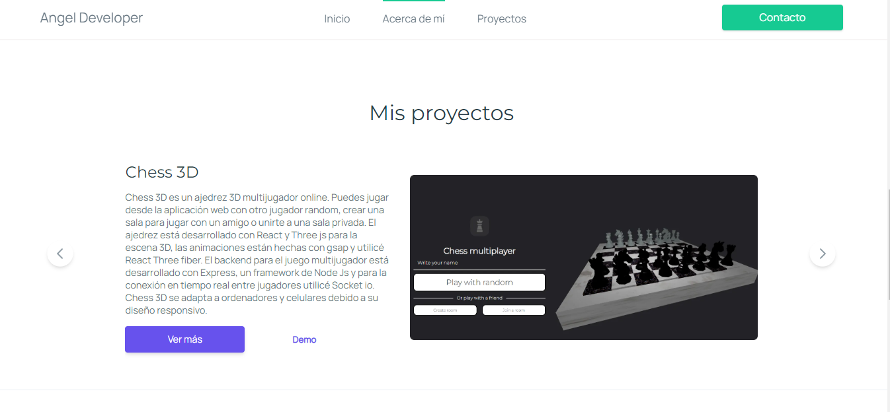

# Angel Luna portfolio
My personal web developer portfolio. For this web I used TypeScript, Next js and Framer motion for the animations. In my portfolio you can see about me, my projects, my skills and my social networks.

[Angel Luna Developer](https://portfolio-angel.vercel.app/)



## Technologies Used
- **Next.js 13** - React framework for production
- **TypeScript** - Type-safe JavaScript
- **Framer Motion** - Animation library
- **GSAP** - Professional-grade animation platform

## Getting Started

First, install dependencies:
```bash
npm install
```

Then, run the development server:
```bash
npm run dev
```

Open [http://localhost:3000](http://localhost:3000) with your browser to see the result.

## Build for Production

```bash
npm run build
npm start
```
